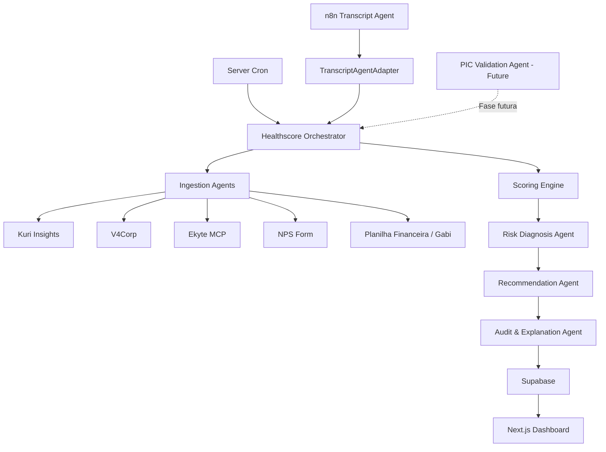

# Healthscore IA

Sistema de agents para calcular, explicar e acompanhar a saúde dos clientes da operação.

O objetivo do projeto é dar clareza para a operação, usando dados reais sobre a saúde de cada cliente, consolidando sinais de resultado, relacionamento, operação, entregas, satisfação e financeiro em um Healthscore mensal.

Este README descreve a arquitetura ideal do sistema e a V1 inicial. A RFC original está em [RFC Implementação Healthscore.md](./RFC%20Implementação%20Healthscore.md).

## Stack

- Frontend: Next.js + Tailwind CSS.
- Backend/App: Next.js server-side, API Routes ou Server Actions.
- Database: Supabase.
- Agents locais: OpenAI API via código do projeto.
- Agent de transcrição: n8n externo, já existente.
- Scheduler: cron no servidor, executado em data e horário específicos.
- Output principal: dashboard e aplicação própria.

## Desenvolvimento Local

Nesta fase, o projeto já possui um núcleo TypeScript local para validar o Healthscore sem LLM, sem APIs externas e sem Supabase.

Comandos:

```bash
npm install
npm run typecheck
npm test
npm run healthscore:mock
```

Estratégia de validação:

- testar cada componente isolado, começando pelo `ScoringEngine`;
- testar o pipeline completo com fixtures;
- manter outputs esperados para contas fictícias;
- no futuro, validar cada agent LLM separadamente antes de ligar no orchestrator;
- quando um output estiver errado, identificar se a falha está no agent, no schema, no scoring ou no orchestrator.

## Princípios

- O score final deve ser calculado por regras determinísticas, versionadas e auditáveis.
- Agents interpretam, enriquecem, explicam e sugerem ações.
- Agents não devem inventar dados ausentes.
- Agents não executam ações operacionais automaticamente na V1; eles apenas sugerem próximos passos.
- Todo output relevante deve ter evidência, fonte e período de referência.
- O sistema deve ser legível por humanos, desenvolvedores e IAs futuras.

## V1 Inicial

Na V1 inicial, o sistema vai operar sem bloqueio por PIC.

O PIC faz parte da arquitetura ideal, mas será implementado em uma etapa futura. Até lá:

- contas sem PIC não serão bloqueadas;
- a ausência de PIC pode ser registrada como `future_requirement`;
- a lógica de `Healthscore Incompleto` fica documentada, mas não ativa;
- o agente de pré-requisitos/PIC será tratado como componente futuro.

O agent de transcrição de reunião já existe e roda fora deste projeto, em um workflow n8n. Neste código, vamos implementar apenas o `TranscriptAgentAdapter`, responsável por consumir/normalizar o output do n8n para alimentar `D2 - Relacionamento & Engajamento`.

## Arquitetura Geral



## Componentes

### Healthscore Orchestrator

Coordena a execução mensal do Healthscore.

Responsabilidades:

- iniciar a execução a partir do cron;
- carregar a lista de contas elegíveis;
- chamar os agents e conectores necessários;
- consolidar os dados normalizados;
- enviar os dados para o `Scoring Engine`;
- chamar agents de diagnóstico, recomendação e auditoria;
- persistir o relatório final no Supabase;
- expor os dados para o dashboard.

O Orchestrator não deve decidir o score por conta própria. Ele coordena o fluxo.

### Ingestion Agents

Responsáveis por buscar e normalizar dados de origem.

Agents/conectores previstos:

- `KuriInsightsIngestionAgent`
- `V4CorpIngestionAgent`
- `EkyteIngestionAgent`
- `NpsIngestionAgent`
- `FinancialIngestionAgent`
- `MeetingTranscriptAgent`

Cada agent deve retornar JSON estruturado, com fonte, período, conta e evidências.

### Transcript Agent via n8n

Agent já existente, executado fora deste projeto em n8n.

Responsabilidades do workflow n8n:

- monitorar pasta de transcrições no Google Drive;
- filtrar arquivos que parecem transcrições;
- extrair texto;
- enviar o texto para IA;
- gerar análise estruturada;
- publicar resumo no Google Chat.

Responsabilidades do `TranscriptAgentAdapter` local:

- receber o output do n8n;
- normalizar indicador, sentimento, tom, resumo e próximos passos;
- mapear o sinal para `RelationshipInput`;
- alimentar `D2 - Relacionamento & Engajamento`;
- não recriar nem reexecutar a análise da transcrição.

Contrato temporário esperado:

```json
{
  "account_id": "string",
  "period": "YYYY-MM",
  "stakeholder_mood": "positive | neutral | negative | unknown",
  "confidence": 0.0,
  "signals": ["string"],
  "summary": "string",
  "source": "meeting_transcript_agent"
}
```

Esse schema será ajustado conforme o payload real exportado pelo n8n.

### Scoring Engine

Componente determinístico responsável pelo cálculo do score.

Responsabilidades:

- calcular as 6 dimensões;
- aplicar pesos;
- aplicar penalizações;
- aplicar travas financeiras;
- retornar score bruto, score final, status e detalhes por dimensão.

O `Scoring Engine` deve ser código puro e testável. Ele não deve depender de LLM para calcular pontos.

### Risk Diagnosis Agent

Agent responsável por explicar o resultado.

Responsabilidades:

- identificar principal dimensão de risco;
- identificar dimensões secundárias;
- explicar por que a conta recebeu aquele status;
- gerar diagnóstico executivo;
- indicar flags de risco.

### Recommendation Agent

Agent responsável por transformar score e diagnóstico em sugestão operacional.

Na V1, este agent apenas sugere ações. Ele não cria tarefas, não altera dados no V4Corp e não dispara comunicações automaticamente.

Responsabilidades:

- seguir o playbook definido na RFC;
- sugerir próximos passos;
- indicar responsável sugerido;
- indicar prazo recomendado;
- indicar registro esperado no sistema.

### Audit & Explanation Agent

Agent responsável por tornar o resultado rastreável.

Responsabilidades:

- consolidar explicação final;
- listar fontes utilizadas;
- registrar evidências;
- apontar dados ausentes;
- preparar payload persistível no Supabase;
- facilitar leitura futura por humanos e IAs.

## Fluxo de Execução

1. O cron dispara a execução mensal.
2. O `Healthscore Orchestrator` cria uma execução para o período.
3. O sistema carrega a lista de contas.
4. Os `Ingestion Agents` coletam dados por fonte.
5. O `Meeting Transcript Agent` entrega sinais de relacionamento.
6. O `Scoring Engine` calcula dimensões, score bruto, travas e score final.
7. O `Risk Diagnosis Agent` explica riscos e causas.
8. O `Recommendation Agent` sugere ações com base no playbook.
9. O `Audit & Explanation Agent` consolida evidências e justificativas.
10. O relatório final é salvo no Supabase.
11. O dashboard exibe score, status, diagnóstico, ações sugeridas e histórico.

## Dimensões do Score

| Dimensão | Peso | Origem |
| --- | ---: | --- |
| D1 - Resultado / Impacto Racional | 25% | Kuri Insights + cliente |
| D2 - Relacionamento & Engajamento | 20% | Meeting Transcript Agent + V4Corp |
| D3 - Operação de Tráfego | 20% | V4Corp + Kuri Insights |
| D4 - Entregas no Prazo | 15% | Ekyte MCP |
| D5 - Satisfação / NPS | 12% | Formulário NPS + LLM quando houver comentário |
| D6 - Saúde Financeira | 8% | Planilha financeira |

Formula:

```text
score = (D1 * 0.25) + (D2 * 0.20) + (D3 * 0.20) + (D4 * 0.15) + (D5 * 0.12) + (D6 * 0.08)
```

## Status

| Score final | Status | Intenção operacional |
| --- | --- | --- |
| 80 a 100 | Saudável | Buscar expansão |
| 60 a 79 | Atenção | Diagnóstico e plano de ação |
| 40 a 59 | Risco | Intervenção imediata |
| 0 a 39 | Crítico | Save Plan |

## Financial Cap

A inadimplência pode limitar o teto do score final:

| Condição | Teto |
| --- | ---: |
| Em dia ou até 7 dias de atraso | Sem trava |
| 8 a 20 dias de atraso | 79 |
| 21 a 45 dias de atraso | 59 |
| Acima de 45 dias ou recorrente | 39 |

## Schemas JSON

### Account Input

```json
{
  "account_id": "string",
  "account_name": "string",
  "period": "YYYY-MM",
  "coordinator_id": "string",
  "am_id": "string",
  "segment": "ecommerce | inside_sales | b2b | institutional | unknown",
  "metadata": {}
}
```

### Normalized Source Signal

```json
{
  "account_id": "string",
  "period": "YYYY-MM",
  "source": "kuri_insights | v4corp | ekyte | nps | financial | meeting_transcript",
  "collected_at": "ISO-8601 datetime",
  "data": {},
  "evidence": {
    "external_id": "string",
    "url": "string",
    "notes": "string"
  },
  "missing_data": false
}
```

### Dimension Score

```json
{
  "dimension": "D1 | D2 | D3 | D4 | D5 | D6",
  "name": "string",
  "score": 0,
  "weight": 0.25,
  "weighted_score": 0,
  "reason": "string",
  "flags": ["string"],
  "evidence_refs": ["string"]
}
```

### Final Healthscore Report

```json
{
  "account_id": "string",
  "account_name": "string",
  "period": "YYYY-MM",
  "raw_score": 0,
  "final_score": 0,
  "status": "Saudavel | Atencao | Risco | Critico | Incompleto",
  "financial_cap_applied": false,
  "financial_cap_value": null,
  "dimensions": [],
  "main_risk_driver": "string",
  "secondary_risk_drivers": ["string"],
  "diagnosis": "string",
  "suggested_action": {
    "summary": "string",
    "owner": "Coordenador de PEG",
    "deadline": "string",
    "required_record": "string",
    "next_steps": ["string"]
  },
  "flags": ["string"],
  "missing_data": ["string"],
  "sources": ["string"],
  "generated_at": "ISO-8601 datetime"
}
```

### Dashboard Summary

```json
{
  "period": "YYYY-MM",
  "total_accounts": 0,
  "healthy_count": 0,
  "attention_count": 0,
  "risk_count": 0,
  "critical_count": 0,
  "incomplete_count": 0,
  "average_score": 0,
  "top_risk_drivers": [
    {
      "dimension": "D2",
      "count": 0
    }
  ]
}
```

## Supabase Model Inicial

Tabelas sugeridas:

- `accounts`: cadastro das contas monitoradas.
- `healthscore_runs`: execuções mensais do cron.
- `source_signals`: dados normalizados coletados por fonte.
- `healthscore_reports`: relatório final por conta e período.
- `dimension_scores`: scores por dimensão.
- `agent_outputs`: outputs brutos dos agents.
- `recommendations`: ações sugeridas.
- `audit_events`: eventos de auditoria e explicabilidade.

## Dashboard

O dashboard deve priorizar clareza operacional.

Visões esperadas:

- visão geral da carteira;
- distribuição por status;
- lista de contas por score;
- filtros por coordenador, AM, status, período e dimensão crítica;
- detalhe da conta;
- histórico mensal;
- diagnóstico principal;
- ação sugerida;
- evidências e fontes utilizadas;
- dados ausentes.

## Roadmap

### V1 Inicial

- Next.js + Tailwind.
- Supabase para persistência.
- Cron mensal no servidor.
- OpenAI API para agents de diagnóstico, recomendação e explicabilidade.
- Acoplamento do agent de transcrição já existente.
- Scoring determinístico baseado na RFC.
- Dashboard operacional.
- Sugestões de ação sem execução automática.

### V1 Completa

- Integração completa com todas as fontes.
- Histórico mensal por conta.
- Comparação mês contra mês.
- Auditoria de evidências.
- Melhor tratamento de dados ausentes.
- Calibração de thresholds com contas reais.

### Fase Futura: PIC

- Validar PIC e handover mínimo.
- Bloquear contas sem PIC da régua normal.
- Aplicar status `Healthscore Incompleto`.
- Usar objetivo, métrica-alvo, prazo de impacto e responsáveis como base da dimensão D1.

### V2

- Margem da conta como trava adicional.
- Categorização de causa de atraso no Ekyte.
- Segmentação por tipo de conta.
- Previsibilidade de entrega por playbook semanal.

## Instruções para IAs Futuras

Antes de alterar regras de score, leia a RFC.

Ao implementar:

- preserve o cálculo determinístico do `Scoring Engine`;
- não mova decisão de score para LLM;
- mantenha schemas JSON explícitos;
- registre dados ausentes em vez de inferir;
- se uma fonte não estiver disponível, marque `missing_data`;
- mantenha separação entre coleta, cálculo, diagnóstico, recomendação e auditoria;
- agents podem sugerir, mas não executar ações operacionais na V1;
- PIC é parte da arquitetura futura, não bloqueia a V1 inicial.

Critério de sucesso do sistema: a operação deve conseguir entender, com dados reais, quais clientes estão saudáveis, quais estão em risco, por que estão nessa faixa e qual ação sugerida deve ser tomada.
